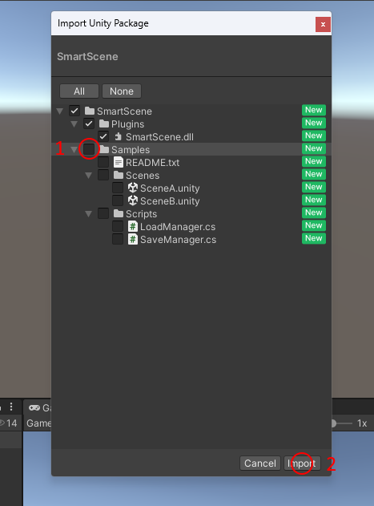

# SmartScene
`SmartScene` by Canyons is a Unity plugin that facilitates seamless data transfer between scenes, enabling developers to easily share variables like strings, integers, and floats without using static classes or singletons.

## Features
- Transfer multiple data types between scenes using a single method.
- Simple and intuitive API for scene management.
- Easy integration into existing Unity projects.
- Minimal setup required.

## Reuqirements
- Unity 5.3 (2018.4 LTS Recommended for better DLL support)
- TextMeshPro (for samples, if you uncheck the folder or delete it later then this requirement doesnt matter)
- Half a brain

## How to Use
Pretty much you can send data by calling SmartScene.ChangeSceneWithData("scene name", variables), you can add as much variables as you want
To load the variables use SmartScene.GetDataFromSceneChange<variableType (like float)>(the number of variable starting from 0)

## Installation
### Unity Package
1. Open Unity and right click on the Project window
2. Click on Import Package

3. Select the SmartScene package
4. Click Import andor uncheck Samples folder if you would like!

